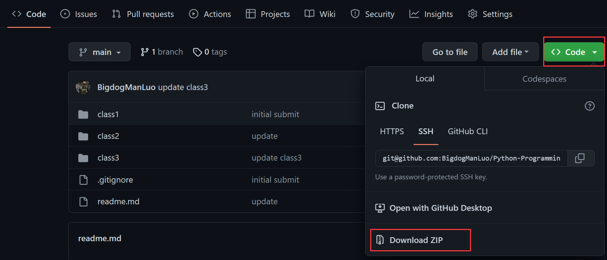
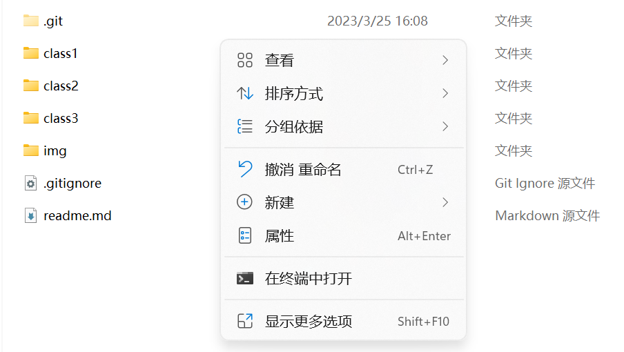
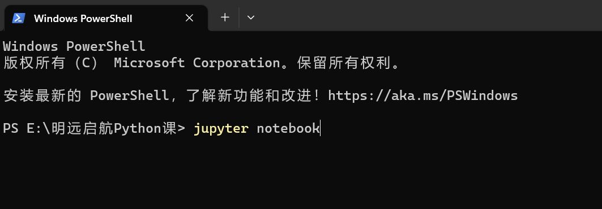

# Python-Programming-Course

Files of the Python Programming Course of Sichuan University's Mingyuan-Qihang Program.
   

明远启航 "Python编程基础" 相关教学课件，目前更新中...

## Download & Install

可以通过该仓库界面的右上角"Code"选项，点击"Download Zip"按钮获取该仓库所有教学课件



如果您安装了git，也可以通过命令行窗口来完成下载。<br>
<br>
打开命令行并输入按顺序输入下列命令：
```shell 
cd "E:/.../xxx"
```
其中，"E:/.../xxx"为您的目标文件夹。然后输入：
```shell
git clone git@github.com:BigdogManLuo/Python-Programming-Course.git
```

<br>

该项目课件为jupyter笔记本文件（后缀为.ipynb）如果您已经正确安装anaconda,那么您可以正常打开该文件。
如果您需要安装jupyter notebook，请参照下列步骤：<br>
<br>
打开命令行并输入：
```shell
pip install jupyter
```

您可以参考[jupyter notebook安装教程](https://zhuanlan.zhihu.com/p/33105153)

## Usage

如果要查看并修改该课件，您需要定位到该课件存放的文件夹并在命令行中启动jupyter notebook

<br>
您可以通过命令行打开：

```shell
cd "E:/.../xxx"
```
然后输入：
```shell
jupyter notebook
```

也可以手动定位到文件夹，再右键点击终端中打开


输入jupyter notebook,回车


## How to Contribute

如果你有任何想法或建议，欢迎提交issue或者pull request。如果有任何问题需要联系，请联系邮箱sashabanks@126.com

## License
本repository基于MIT许可证发布，详细信息请参见LICENSE文件。<br>
This repository is released under the MIT License. For more information, please refer to the LICENSE file.